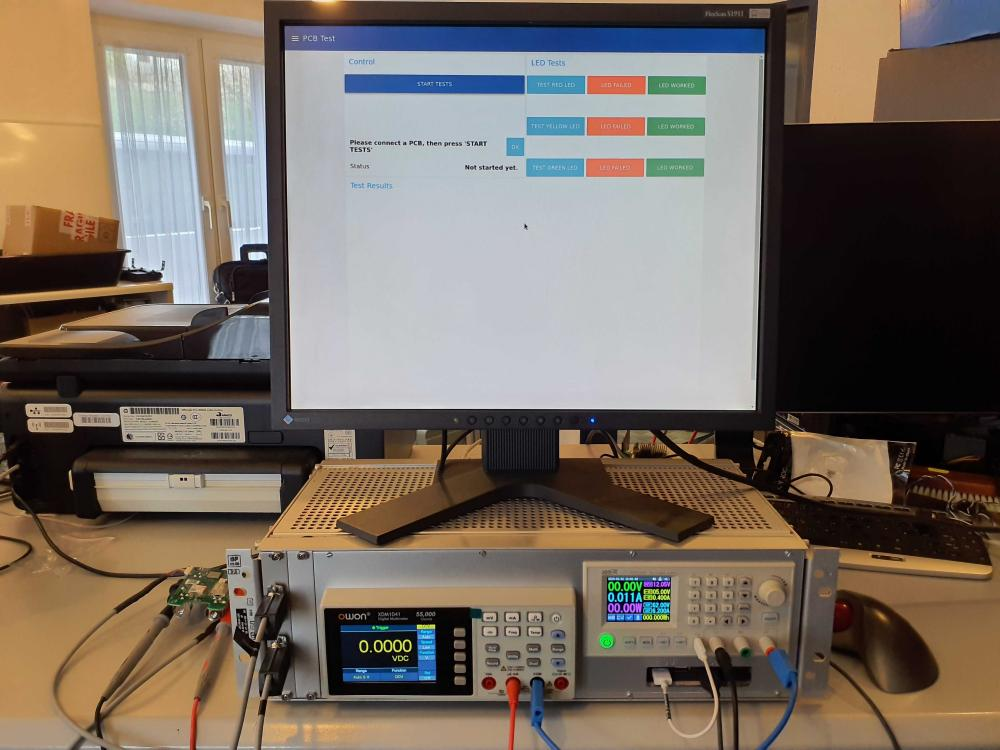
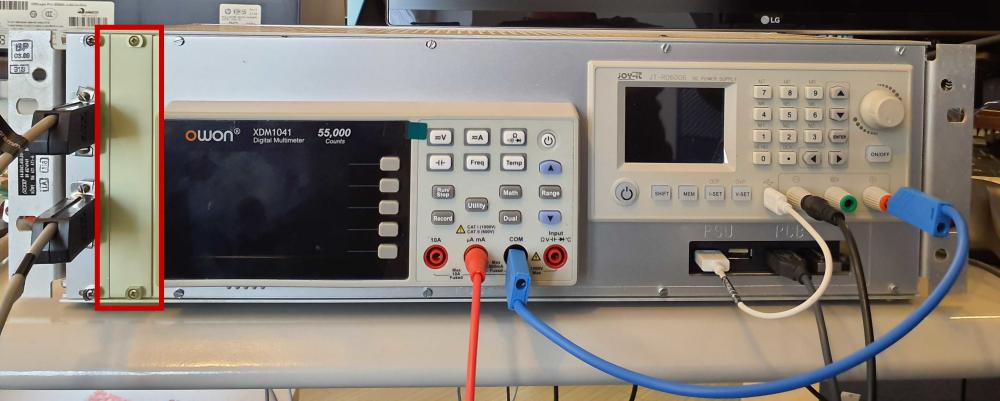
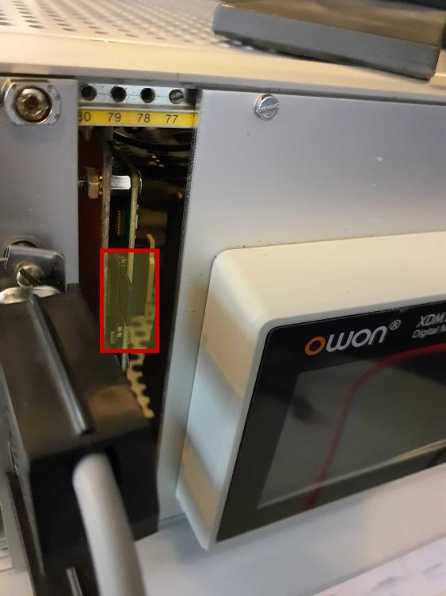
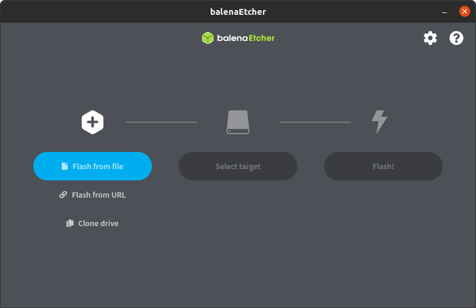
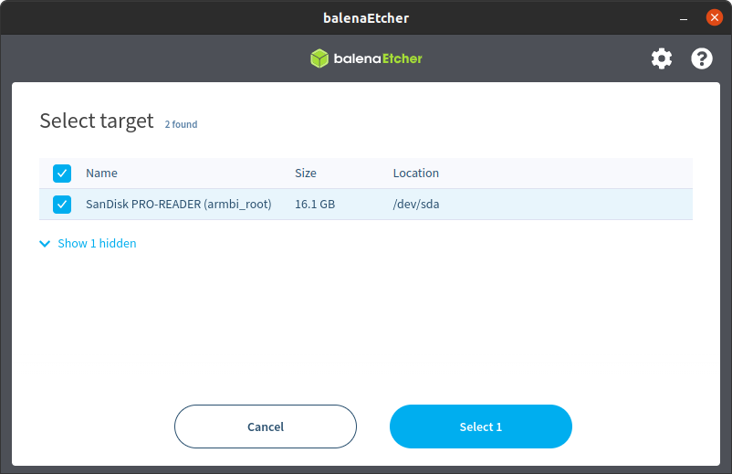

Firmware Update of PCB Test Stand V1
====================================

1) Remove second cover on the front using a screw driver:
    - 
2) Pull out the SD Card
    - 
3) Place it into a Card Reader on your PC
4) Run `balena-etcher`
    - It can be downloaded from [https://etcher.balena.io/](https://etcher.balena.io/)
5) Choose `Flash from file` and select `Armbian-unofficial_24.2.1_Rockpi-4b_bookworm_current_6.6.25_minimal.img.xz`:
    - 
    - The file can be downloaded from [Armbian Build](https://github.com/ZeptaIO/armbian_build/actions/workflows/build.yml)
    - After downloading, unpack `images.zip` and find the compressed image file (`.img.xz` ending) 
6) Click `Select target`, choose your SD-Card:
    - **CAUTION**: remove all other drives like USB drives before to be really sure to choose the right one here. All data will be deleted on the selected target.
    - 
7) Click `Flash!`
8) Place SD-Card back in the test stand with the contacts showing towards the test stand and to the right.
9) Boot it up to test if the SD-Card was seated correctly.
10) Place back the cover.
